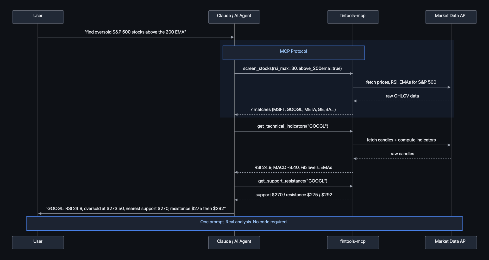

# fintools-mcp

Financial analysis tools for AI assistants via [MCP](https://modelcontextprotocol.io) (Model Context Protocol).

Give Claude, ChatGPT, Cursor, or any MCP-compatible AI access to real financial analysis — not just stock prices, but the analytical toolkit a trader actually uses.

## Tools

| Tool | What it does |
|------|-------------|
| `get_technical_indicators` | RSI, MACD, ATR, EMAs (9/21/50/200), Fibonacci levels, trend assessment |
| `get_stock_quote` | Current price, volume, 52-week range, market cap |
| `get_trend_score` | Trend score from -100 (strong downtrend) to +100 (strong uptrend) with component breakdown |
| `get_support_resistance` | Key support/resistance levels with touch counts and strength ratings |
| `screen_stocks` | Screen S&P 500 by RSI, trend score, EMA position, relative volume — find setups fast |
| `analyze_options_chain` | Options chain with IV analysis, liquidity filtering, put/call ratios |
| `calculate_position_size` | Risk-based position sizing with stop loss and profit target |
| `calculate_atr_position` | ATR-based position sizing — auto-calculates stop and target from volatility |
| `analyze_trades` | Win rate, profit factor, Sharpe ratio, drawdown, streaks from trade P&Ls |
| `compare_tickers` | Side-by-side technical comparison across multiple symbols |

## How it works



## Quick Start

### Install

```bash
pip install fintools-mcp
```

Or with [uv](https://docs.astral.sh/uv/):

```bash
uv pip install fintools-mcp
```

### Add to Claude Desktop

Edit `~/Library/Application Support/Claude/claude_desktop_config.json`:

```json
{
  "mcpServers": {
    "fintools": {
      "command": "uv",
      "args": ["run", "--from", "fintools-mcp", "fintools-mcp"]
    }
  }
}
```

Or if installed via pip:

```json
{
  "mcpServers": {
    "fintools": {
      "command": "fintools-mcp"
    }
  }
}
```

### Add to Claude Code

```bash
claude mcp add fintools -- uv run --from fintools-mcp fintools-mcp
```

## Examples

Once configured, you can ask your AI assistant things like:

- "Find oversold S&P 500 stocks still above their 200 EMA"
- "What's SPY's trend score?"
- "Show me support and resistance levels for NVDA"
- "What's the technical setup on AAPL right now?"
- "Analyze the SPY options chain for next Friday"
- "If I want to go long NVDA with a $100k account risking 1.5%, how many shares and where's my stop?"
- "Compare AAPL, GOOGL, MSFT, and AMZN — which has the strongest trend?"
- "Here are my last 20 trades: [150, -80, 200, ...] — what's my win rate and Sharpe?"

## Example Output

### Technical Indicators
```
> "What's the technical setup on SPY?"

SPY @ $573.42
  RSI(14): 58.3 — bullish momentum
  MACD: 2.14 (histogram +0.38, bullish)
  ATR(14): $7.82
  EMAs: 9 > 21 > 50 > 200 (fully stacked bullish)
  Fibonacci: In golden pocket (0.618-0.65 retracement)
  Trend: Bullish (all signals aligned)
```

### Position Sizing
```
> "Size a long position on AAPL at $227, stop $220, target $245"

  Shares: 214
  Position value: $48,578
  Risk: $1,498 (1.5% of $100k)
  Reward: $3,852
  R:R ratio: 2.57
```

## Architecture

```
fintools-mcp/
├── fintools_mcp/
│   ├── server.py              # MCP server — tool definitions
│   ├── data.py                # Market data via yfinance
│   ├── indicators/            # Technical indicators (standalone, no deps)
│   │   ├── rsi.py             # RSI — Wilder's smoothing
│   │   ├── macd.py            # MACD (12, 26, 9)
│   │   ├── atr.py             # ATR — Average True Range
│   │   ├── ema.py             # EMA — any period
│   │   ├── vwap.py            # VWAP — intraday, daily reset
│   │   └── fibonacci.py       # Fibonacci retracement + golden pocket
│   └── analysis/
│       ├── position_sizer.py  # Risk-based + ATR-based sizing
│       └── trade_stats.py     # KPI calculator (60+ metrics)
└── tests/
```

## Data Sources

- **Stock data:** Yahoo Finance (free, no API key required)
- **Options data:** Yahoo Finance options chains
- No API keys needed for basic functionality.

## Development

```bash
git clone https://github.com/slimbiggins007/fintools-mcp.git
cd fintools-mcp
uv sync
uv run python -m fintools_mcp  # starts the MCP server
```

Run tests:
```bash
uv run pytest
```

## License

MIT
